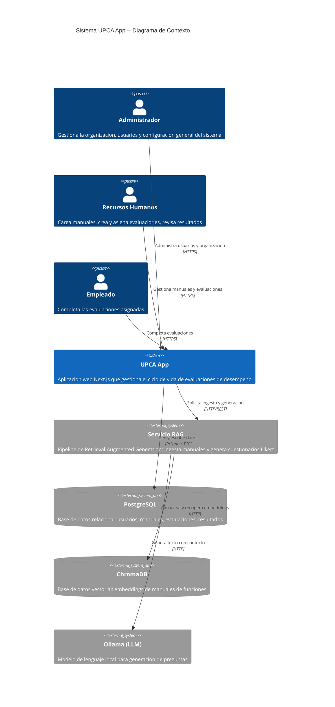
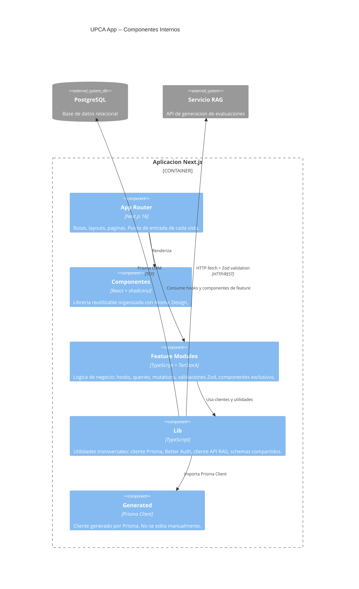

# Arquitectura del Sistema -- UPCA App

**Proyecto**: UPCA App -- Sistema Inteligente de Evaluacion de Desempeno
**Tipo**: Trabajo de grado -- Tecnologia en Desarrollo de Software
**Ultima actualizacion**: 2026-06-15

---

## Tabla de Contenidos

1. [Vision General](#1-vision-general)
2. [Diagrama de Arquitectura](#2-diagrama-de-arquitectura)
3. [Estructura del Proyecto](#3-estructura-del-proyecto)
4. [Capas y Flujo de Datos](#4-capas-y-flujo-de-datos)
5. [Autenticacion y Autorizacion](#5-autenticacion-y-autorizacion)
6. [Base de Datos](#6-base-de-datos)
7. [Integracion Externa -- Servicio RAG](#7-integracion-externa----servicio-rag)
8. [Convenciones Clave](#8-convenciones-clave)
9. [Seguridad](#9-seguridad)
10. [Decisiones Tecnicas y Tradeoffs](#10-decisiones-tecnicas-y-tradeoffs)
11. [Referencia de Enums](#11-referencia-de-enums)

---

## 1. Vision General

UPCA App es un sistema web diseñado para automatizar la generacion de evaluaciones de desempeño basadas en escala Likert, utilizando como insumo los manuales de funciones de cada cargo dentro de una organizacion.

El sistema se compone de **dos servicios independientes**:

| Servicio | Responsabilidad | Tecnologia |
|----------|----------------|------------|
| **UPCA App (Next.js)** | Interfaz de usuario, gestion de datos, autenticacion, orquestacion de evaluaciones | Next.js 16, TypeScript, PostgreSQL |
| **Servicio RAG** | Ingesta de manuales, generacion de preguntas/evaluaciones mediante LLM con contexto recuperado | FastAPI, ChromaDB, Ollama |

La aplicacion Next.js actua como el punto de entrada para todos los usuarios. Gestiona el ciclo de vida completo de las evaluaciones: carga de manuales de funciones, solicitud de generacion de cuestionarios al servicio RAG, asignacion de evaluaciones a empleados, recoleccion de respuestas y presentacion de resultados.

El servicio RAG es un componente independiente desarrollado por otro miembro del equipo de tesis. Se comunica con la aplicacion Next.js exclusivamente a traves de una API HTTP REST. Su contrato esta documentado en [`docs/rag-api-contract.md`](./rag-api-contract.md).

### Stack Tecnologico

| Capa | Tecnologia | Version | Proposito |
|------|-----------|---------|-----------|
| Framework | Next.js (App Router) | 16.2.9 | SSR, Server Actions, routing |
| Lenguaje | TypeScript | 5.x | Type safety |
| UI Library | React | 19.2.4 | Componentes, hooks |
| Estilos | Tailwind CSS | 4.x | Utility-first CSS |
| Componentes | shadcn/ui | latest | Libreria de componentes (CLI, copiados a `components/ui/`) |
| Autenticacion | Better Auth + Prisma adapter | latest | Sesiones, roles, auth completa |
| ORM | Prisma | 7.x | ESM, driver adapters, `prisma.config.ts` |
| Base de Datos | PostgreSQL | 16+ | Docker local, Vercel Postgres produccion |
| Validacion | Zod | latest | Schemas para inputs, outputs y API |
| Formularios | TanStack Form | latest | Estado de formularios |
| Data Fetching | TanStack Query | latest | Estado del servidor, caching, mutations |
| Linting/Formato | Biome | 2.2.0 | Reemplaza ESLint + Prettier |
| Package Manager | pnpm | latest | Rapido, eficiente en disco |

---

## 2. Diagrama de Arquitectura

### 2.1 Diagrama de Contexto (C4 -- Nivel 1)



### 2.2 Diagrama de Componentes (C4 -- Nivel 3, Aplicacion Next.js)



---

## 3. Estructura del Proyecto

```
src/
├── app/                          # Next.js App Router (rutas)
│   ├── (auth)/                   # Route group: rutas publicas
│   │   ├── sign-in/              # Inicio de sesion
│   │   └── sign-up/              # Registro
│   ├── (dashboard)/              # Route group: rutas autenticadas
│   │   ├── layout.tsx            # Layout con sidebar/navegacion
│   │   ├── evaluations/          # CRUD de evaluaciones
│   │   ├── manuals/              # Gestion de manuales de funciones
│   │   ├── results/              # Visualizacion de resultados
│   │   └── settings/             # Configuracion de usuario/organizacion
│   ├── api/
│   │   └── auth/[...all]/        # Catch-all de Better Auth
│   ├── layout.tsx                # Layout raiz
│   └── page.tsx                  # Landing page
│
├── components/                   # Atomic Design -- componentes reutilizables
│   ├── ui/                       # shadcn/ui (generados por CLI, no editar directamente)
│   ├── atoms/                    # Botones, inputs, labels personalizados
│   ├── molecules/                # SearchBar, FormField, UserAvatar
│   ├── organisms/                # EvaluationCard, ManualUploader, Navbar
│   └── templates/                # DashboardLayout, AuthLayout
│
├── features/                     # Modulos de feature (logica de negocio)
│   ├── auth/                     # Hooks y providers de autenticacion
│   │   └── components/           # Componentes exclusivos de auth
│   ├── evaluations/              # Hooks, queries, tipos para evaluaciones
│   │   └── components/           # Componentes exclusivos de evaluaciones
│   ├── manuals/                  # Hooks, queries, tipos para manuales
│   │   └── components/           # Componentes exclusivos de manuales
│   └── results/                  # Hooks, queries, tipos para resultados
│       └── components/           # Componentes exclusivos de resultados
│
├── lib/                          # Utilidades compartidas (cross-cutting)
│   ├── auth.ts                   # Configuracion de Better Auth (servidor)
│   ├── auth-client.ts            # Cliente de auth (signIn, signUp, etc.)
│   ├── prisma.ts                 # Singleton del cliente Prisma
│   ├── api.ts                    # Cliente HTTP para el servicio RAG
│   └── validators/               # Schemas Zod compartidos entre features
│
├── generated/                    # Cliente generado por Prisma
│   └── prisma/
│
└── types/                        # Tipos globales de TypeScript
```

### Convenciones de Organizacion

**Componentes reutilizables** se ubican en `src/components/` y siguen la jerarquia de Atomic Design:

- **Atoms**: elementos UI minimos e indivisibles (Button, Input, Label, Badge). Envuelven o extienden componentes de shadcn/ui con estilos o comportamientos especificos del proyecto.
- **Molecules**: combinaciones de atoms que forman una unidad funcional (SearchBar, FormField, UserAvatar).
- **Organisms**: secciones completas de interfaz compuestas por molecules y atoms (Navbar, EvaluationCard, ManualUploader).
- **Templates**: estructuras de layout que definen la disposicion de organismos en una pagina (DashboardLayout, AuthLayout).

**Componentes exclusivos de una feature** se ubican en `src/features/{feature}/components/`. Estos componentes NO se reutilizan fuera de su feature. Si un componente necesita ser compartido entre features, se promueve a `src/components/` siguiendo la jerarquia de Atomic Design.

**Modulos de feature** (`src/features/`) encapsulan toda la logica de negocio asociada a un dominio funcional. Cada modulo puede contener:

- Custom hooks (logica de estado y efectos)
- Queries y mutations (TanStack Query)
- Tipos e interfaces especificos del dominio
- Schemas Zod para validacion
- Componentes exclusivos de la feature

Las importaciones entre features se hacen a traves de `lib/` o `types/`, nunca directamente entre features.

**`src/lib/`** contiene utilidades transversales que son compartidas entre multiples features: el cliente Prisma, la configuracion de Better Auth, el wrapper de fetch para el servicio RAG y los schemas Zod que se usan en mas de un modulo.

---

## 4. Capas y Flujo de Datos

La aplicacion se organiza en cuatro capas con responsabilidades bien definidas.

### 4.1 Capas

| # | Capa | Ubicacion | Responsabilidad |
|---|------|-----------|----------------|
| 1 | **Presentacion** | `src/app/` + `src/components/` | Renderizado de UI, captura de input con TanStack Form, navegacion |
| 2 | **Feature** | `src/features/` | Logica de negocio, hooks, TanStack Query (queries/mutations), validacion Zod |
| 3 | **Datos** | `src/lib/` | Cliente Prisma, configuracion Better Auth, Server Actions, Route Handlers |
| 4 | **Externa** | PostgreSQL + Servicio RAG | Persistencia relacional y generacion de evaluaciones via LLM |

### 4.2 Flujo de Datos Tipico

El siguiente flujo describe el recorrido de una operacion tipica (por ejemplo, solicitar la generacion de una evaluacion):

```
[1] Componente (Presentacion)
 |  El usuario interactua con un formulario gestionado por TanStack Form.
 |
 v
[2] Hook de Feature (Feature Layer)
 |  El componente invoca un hook del modulo correspondiente.
 |  El hook usa TanStack Query para ejecutar una mutation.
 |
 v
[3] Server Action o Route Handler (Data Layer)
 |  La mutation llama a un Server Action o Route Handler.
 |  Se valida el input con Zod. Se ejecuta la logica del servidor.
 |
 v
[4] Prisma (Data Layer)
 |  Se persisten los datos en PostgreSQL a traves de Prisma.
 |
 v
[5] Cliente RAG (Data Layer -> Externa)
    Si la operacion requiere generacion, se invoca el servicio RAG
    via HTTP. La respuesta se valida con Zod antes de procesarla.
```

Para operaciones de lectura, el flujo es inverso: TanStack Query cachea la respuesta del servidor y la expone al componente via hooks reactivos.

### 4.3 Reglas de Dependencia

Las dependencias fluyen SIEMPRE hacia abajo. Ninguna capa inferior conoce a las capas superiores:

```
Presentacion  ->  Feature  ->  Datos  ->  Externa
```

- La capa de Presentacion NUNCA accede directamente a Prisma ni al servicio RAG.
- La capa de Feature NUNCA renderiza UI (excepto componentes propios dentro de `features/{name}/components/`).
- La capa de Datos NUNCA contiene logica de negocio; solo ejecuta operaciones de lectura/escritura y validacion.

---

## 5. Autenticacion y Autorizacion

### 5.1 Tecnologia

La autenticacion se implementa con **Better Auth** utilizando el **Prisma adapter** para persistir sesiones, cuentas y tokens directamente en PostgreSQL.

### 5.2 Metodo de Autenticacion

- **Email y contraseña** como unico metodo de autenticacion.
- No se implementan proveedores OAuth externos.

### 5.3 Roles

El sistema define tres roles mediante un campo `role` en el modelo `User`. No se utiliza el plugin RBAC de Better Auth.

| Rol | Descripcion |
|-----|-------------|
| `ADMIN` | Administrador del sistema. Gestiona la organizacion, usuarios y configuracion global. |
| `HR` | Recursos Humanos. Carga manuales de funciones, crea evaluaciones, asigna evaluaciones a empleados y revisa resultados. |
| `EMPLOYEE` | Empleado. Completa las evaluaciones que le son asignadas. |

La autorizacion se basa en un **campo simple de rol** (`enum Role`) en el modelo `User`. La verificacion de permisos se realiza comparando el valor del campo `role` contra los roles permitidos para cada operacion.

### 5.4 Proteccion de Rutas

- El **middleware de Next.js** intercepta las solicitudes a rutas protegidas, verifica la existencia de una sesion valida y comprueba que el rol del usuario tenga acceso a la ruta solicitada.
- **Route groups** organizan la separacion entre rutas publicas y protegidas:
  - `(auth)/` -- Rutas publicas: `sign-in`, `sign-up`. Accesibles sin sesion.
  - `(dashboard)/` -- Rutas protegidas: requieren sesion activa. El acceso a sub-rutas se restringe segun el rol.

### 5.5 Archivos de Configuracion

| Archivo | Proposito |
|---------|-----------|
| `src/lib/auth.ts` | Configuracion del servidor de Better Auth (secret, adapter Prisma, plugins) |
| `src/lib/auth-client.ts` | Cliente de Better Auth para el navegador (`signIn`, `signUp`, `useSession`) |
| `src/app/api/auth/[...all]/route.ts` | Catch-all route handler que delega todas las rutas `/api/auth/*` a Better Auth |

---

## 6. Base de Datos

### 6.1 Motor

- **PostgreSQL 16+** como motor relacional.
- **Desarrollo local**: instancia PostgreSQL en Docker Compose.
- **Produccion**: Vercel Postgres (a configurar en etapas posteriores).

### 6.2 ORM -- Prisma v7

Prisma v7 introduce cambios significativos respecto a versiones anteriores:

| Caracteristica | Detalle |
|---------------|---------|
| Formato de configuracion | `prisma.config.ts` (TypeScript, no JSON) |
| Soporte de modulos | ESM nativo |
| Driver adapters | `@prisma/adapter-pg` para la conexion a PostgreSQL |
| Cliente generado | Se genera en `src/generated/prisma/` |
| Migraciones | Se almacenan en `prisma/migrations/` |

### 6.3 Archivos Relevantes

| Archivo | Proposito |
|---------|-----------|
| `prisma/schema.prisma` | Definicion del schema de la base de datos |
| `prisma.config.ts` | Configuracion de Prisma (ESM, output path) |
| `src/generated/prisma/` | Cliente Prisma generado (no editar manualmente) |
| `src/lib/prisma.ts` | Singleton del cliente Prisma para evitar multiples conexiones en desarrollo |
| `prisma/migrations/` | Historial de migraciones |

### 6.4 Flujo de Migraciones

1. Se modifica `prisma/schema.prisma`.
2. Se ejecuta `pnpm prisma migrate dev --name <nombre>` para generar y aplicar la migracion.
3. El cliente Prisma se regenera automaticamente en `src/generated/prisma/`.

---

## 7. Integracion Externa -- Servicio RAG

### 7.1 Descripcion

El servicio RAG es una aplicacion independiente desarrollada en Python (FastAPI) por otro miembro del equipo de tesis. Implementa un pipeline de Retrieval-Augmented Generation que:

1. **Ingesta** manuales de funciones en formato PDF/texto, generando embeddings que se almacenan en ChromaDB.
2. **Genera** preguntas de evaluacion en escala Likert, utilizando Ollama (LLM local) con contexto recuperado de ChromaDB.
3. **Reporta** el estado de procesamiento de cada operacion.

### 7.2 Endpoints

| Endpoint | Metodo | Descripcion |
|----------|--------|-------------|
| Ingesta de manual | `POST` | Envia un manual para su procesamiento y almacenamiento en la base vectorial |
| Generacion de evaluacion | `POST` | Solicita la generacion de preguntas Likert para un cargo especifico |
| Consulta de estado | `GET` | Verifica el estado de una operacion de ingesta o generacion |

El contrato detallado de la API (schemas de request/response, codigos de error, ejemplos) se documenta en [`docs/rag-api-contract.md`](./rag-api-contract.md).

### 7.3 Comunicacion

- La comunicacion se realiza via **HTTP REST** utilizando `fetch` nativo.
- El cliente HTTP se centraliza en `src/lib/api.ts`.
- **Todas las respuestas** del servicio RAG se validan con schemas Zod antes de ser procesadas por la aplicacion. Esto garantiza que cambios inesperados en la API del servicio externo se detecten en tiempo de ejecucion con mensajes de error claros.

### 7.4 Patron de Integracion

```
Feature Hook (TanStack Query mutation)
    -> Server Action
        -> src/lib/api.ts (fetch + Zod parse)
            -> Servicio RAG (HTTP)
```

La aplicacion Next.js NUNCA expone el servicio RAG directamente al navegador. Todas las llamadas pasan por Server Actions o Route Handlers, que actuan como capa intermedia.

---

## 8. Convenciones Clave

### 8.1 Validacion

- **Todos** los inputs (formularios, parametros de API, respuestas externas) se validan con **Zod**.
- Los schemas compartidos entre features se ubican en `src/lib/validators/`.
- Los schemas especificos de un dominio se ubican dentro del modulo de feature correspondiente.

### 8.2 Formularios

- **TanStack Form** es la unica herramienta para gestion de formularios.
- No se utiliza estado raw de formularios (`useState` para campos individuales).
- La validacion de formularios se integra con schemas Zod.

### 8.3 Data Fetching

- **TanStack Query** es la unica herramienta para obtener y mutar datos del servidor.
- No se utiliza `useEffect` para fetching de datos.
- Las query keys siguen una convencion consistente definida en cada modulo de feature.

### 8.4 Componentes UI

- **shadcn/ui** como base de componentes. Se instalan via CLI y se copian a `src/components/ui/`.
- Los componentes de shadcn/ui se extienden y componen siguiendo **Atomic Design** en `src/components/`.
- Los componentes no deben contener logica de negocio. La logica reside en los hooks de feature.

### 8.5 Linting y Formato

- **Biome 2.2.0** como unica herramienta de linting y formateo.
- No se utiliza ESLint ni Prettier.
- La configuracion de Biome se mantiene en `biome.json` en la raiz del proyecto.

### 8.6 Git

- Se utiliza **Conventional Commits** para todos los mensajes de commit.
- Formato: `tipo(alcance): descripcion` (e.g., `feat(evaluations): add Likert scale form`).

### 8.7 Idioma

- **Interfaz de usuario**: texto en español.
- **Codigo fuente**: nombres de variables, funciones, componentes y comentarios en ingles.

---

## 9. Seguridad

| Aspecto | Implementacion |
|---------|---------------|
| **Autenticacion** | Better Auth con cookies de sesion seguras (httpOnly, secure en produccion) |
| **Autorizacion** | Campo `role` en User, verificado en cada Server Action y Route Handler via `requireRole()` |
| **Validacion** | Zod en todas las fronteras: input del usuario, respuestas de API externa, parametros de ruta |
| **CSRF** | Manejado automaticamente por Better Auth |
| **SQL Injection** | Prevenido por Prisma (queries parametrizadas) |
| **Uploads** | Validacion de tipo de archivo (PDF/DOCX) y tamano (max 20MB) antes de enviar al RAG |
| **Variables de entorno** | Nunca expuestas al cliente. Acceso exclusivo desde Server Actions y Route Handlers |
| **Servicio RAG** | El navegador NUNCA accede directamente al servicio RAG. Todas las llamadas pasan por el servidor Next.js |

---

## 10. Decisiones Tecnicas y Tradeoffs

| Decision | Alternativa descartada | Razon |
|----------|----------------------|-------|
| **Prisma v7** | Drizzle ORM | Preferencia del equipo, documentacion mas madura, Better Auth tiene guia oficial con Prisma. Tradeoff: Prisma v7 requiere driver adapters y configuracion ESM. |
| **Better Auth** | NextAuth / Auth.js | API mas simple, mejor DX, adaptador Prisma nativo, control total sobre el schema de auth. Tradeoff: ecosistema mas pequeno que NextAuth. |
| **Roles simples (campo enum)** | Plugin RBAC de Better Auth (Organization) | El MVP es single-org, no necesita multi-tenancy. El plugin agrega 4-5 tablas extra innecesarias. Tradeoff: si el sistema crece a multi-empresa, habria que migrar. |
| **TanStack Form** | React Hook Form | Mejor integracion con TanStack Query, type-safe nativo, ecosistema unificado. Tradeoff: comunidad mas pequena, menos ejemplos disponibles. |
| **Biome** | ESLint + Prettier | Herramienta unica, mas rapida, ya configurada en el proyecto. Tradeoff: menos plugins que ESLint. |
| **Server Actions (ops internas) + Route Handlers (API externa)** | Solo Route Handlers | Server Actions son mas simples para mutations internas. Route Handlers se reservan para lo que necesite ser consumido externamente o por Better Auth. Tradeoff: dos patrones coexisten. |
| **Metricas hibridas** | Tabla Result separada o solo on-the-fly | Score pre-calculado en EvaluationAssignment para dashboards rapidos, detalle por dimension on-the-fly. Para el volumen de una PyME local, es el balance optimo. Tradeoff: si el score necesita recalcularse, hay que actualizar el campo. |

---

## 11. Referencia de Enums

Los siguientes enums se definen en el schema de Prisma y se utilizan a lo largo de toda la aplicacion.

### Role

Define el rol de un usuario dentro del sistema.

| Valor | Descripcion |
|-------|-------------|
| `ADMIN` | Administrador del sistema. Acceso completo a configuracion y gestion de usuarios. |
| `HR` | Recursos Humanos. Gestiona manuales, crea y asigna evaluaciones, revisa resultados. |
| `EMPLOYEE` | Empleado. Completa las evaluaciones asignadas. |

### ManualStatus

Estado del procesamiento de un manual de funciones.

| Valor | Descripcion |
|-------|-------------|
| `PENDING` | El manual fue cargado pero aun no se envio al servicio RAG. |
| `PROCESSING` | El manual esta siendo procesado por el servicio RAG (ingesta de embeddings). |
| `PROCESSED` | La ingesta finalizo exitosamente. El manual esta disponible para generar evaluaciones. |
| `ERROR` | La ingesta fallo. Se debe reintentar o revisar el contenido del manual. |

### EvaluationStatus

Estado del ciclo de vida de una evaluacion.

| Valor | Descripcion |
|-------|-------------|
| `DRAFT` | La evaluacion fue creada pero aun no tiene preguntas generadas. |
| `REVIEW` | Las preguntas fueron generadas. HR esta revisando, aprobando y calificando las preguntas. |
| `ACTIVE` | La evaluacion fue activada (todas las preguntas revisadas) y asignada a empleados. |
| `CLOSED` | El periodo de respuesta finalizo. Los resultados estan disponibles. |

### Dimensiones de Calificacion IAP

Las preguntas generadas NO tienen una dimension o categoria asignada. Son una lista plana.

Las unicas "dimensiones" del sistema son las **3 dimensiones de calificacion IAP** que HR utiliza para evaluar la calidad de cada pregunta generada:

| Campo | Dimension | Descripcion |
|-------|-----------|-------------|
| `relevanceRating` | Pertinencia | La pregunta es relevante para las funciones reales del cargo. |
| `coherenceRating` | Coherencia | La pregunta esta bien redactada y es clara. |
| `adequacyRating` | Adecuacion | El nivel de la pregunta es apropiado para el cargo evaluado. |

Cada campo es un entero de 1 a 5 (nullable hasta que HR revise la pregunta).

### QuestionStatus

Estado de una pregunta generada por el servicio RAG.

| Valor | Descripcion |
|-------|-------------|
| `PENDING` | La pregunta fue generada por el RAG y espera revision de HR. |
| `APPROVED` | La pregunta fue revisada y aprobada por HR sin modificaciones. |
| `EDITED` | La pregunta fue editada por HR (el texto original se preserva en `originalText`). |
| `REJECTED` | La pregunta fue rechazada por HR (no se incluira en la evaluacion). |

### AssignmentStatus

Estado de la asignacion de una evaluacion a un empleado especifico.

| Valor | Descripcion |
|-------|-------------|
| `PENDING` | La evaluacion fue asignada pero el empleado aun no la inicio. |
| `IN_PROGRESS` | El empleado comenzo a responder la evaluacion. |
| `COMPLETED` | El empleado finalizo la evaluacion y envio sus respuestas. |
