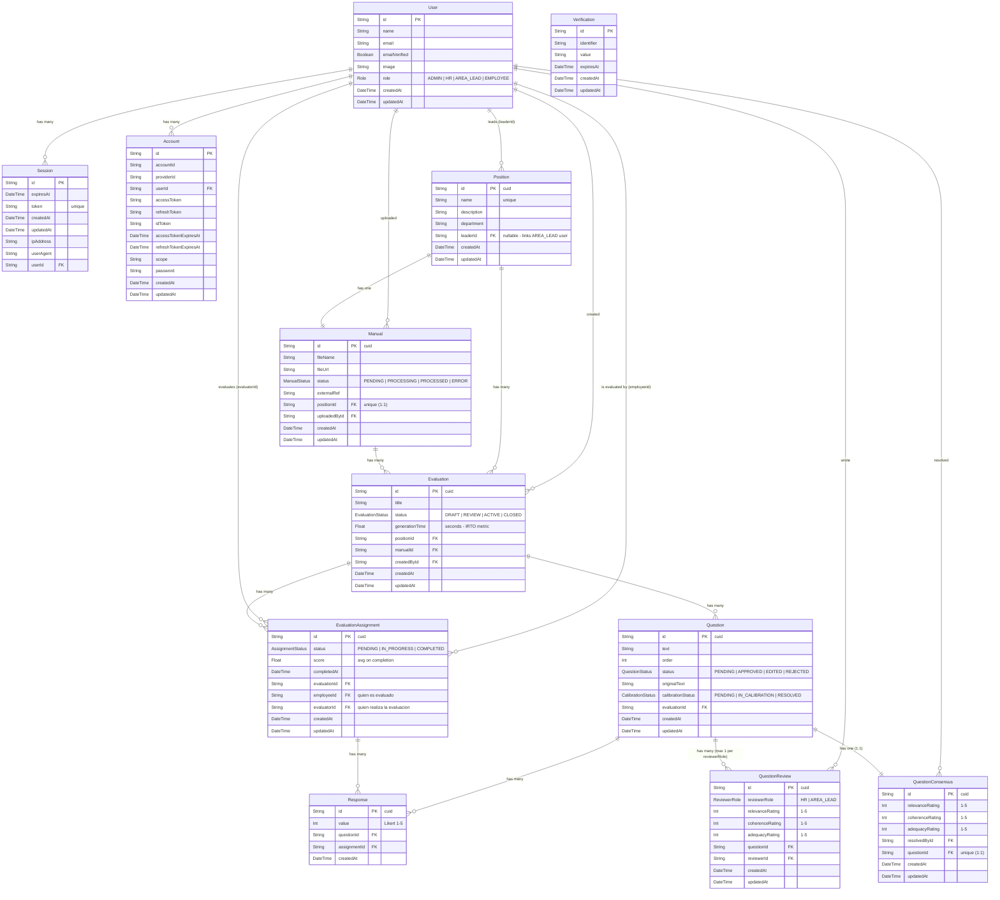

# UPCA App — Entity Relationship Diagram

Database schema for the automated performance evaluation generation system. Uses Prisma v7 with PostgreSQL, Better Auth for authentication, and role-based access control.

## Enum Legend

| Enum | Values | Description |
|------|--------|-------------|
| **Role** | `ADMIN`, `HR`, `AREA_LEAD`, `EMPLOYEE` | User access level. Default: `EMPLOYEE`. `AREA_LEAD` is the second reviewer in the two-reviewer calibration scheme. |
| **ManualStatus** | `PENDING`, `PROCESSING`, `PROCESSED`, `ERROR` | Lifecycle of a manual upload and RAG processing |
| **EvaluationStatus** | `DRAFT`, `REVIEW`, `ACTIVE`, `CLOSED` | Evaluation workflow stages |
| **QuestionStatus** | `PENDING`, `APPROVED`, `EDITED`, `REJECTED` | HR editorial review status for AI-generated questions (text quality). Orthogonal to `CalibrationStatus`. |
| **ReviewerRole** | `HR`, `AREA_LEAD` | Identifies which reviewer slot a `QuestionReview` rating fills. Max 1 review per role per question. |
| **CalibrationStatus** | `PENDING`, `IN_CALIBRATION`, `RESOLVED` | Tracks the two-reviewer validation state of a `Question`. `PENDING` = missing reviews, `IN_CALIBRATION` = reviews diverge (|Δ| ≥ 2), `RESOLVED` = consensus reached. |
| **AssignmentStatus** | `PENDING`, `IN_PROGRESS`, `COMPLETED` | Employee evaluation assignment progress |

## Unique Constraints

| Table | Constraint | Purpose |
|-------|-----------|---------|
| **Manual** | `positionId` unique | Enforces 1:1 relationship with Position |
| **EvaluationAssignment** | `(evaluationId, employeeId)` | Un solo evaluador por empleado por evaluacion |
| **Response** | `(questionId, assignmentId)` | One response per question per assignment |
| **QuestionReview** | `(questionId, reviewerRole)` | Max 1 HR + 1 AREA_LEAD review per question |
| **QuestionConsensus** | `questionId` unique | Enforces 1:1 relationship with Question |
